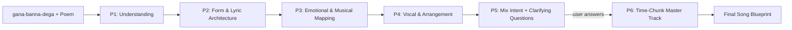

# Gana-Banna-Dega: Poem-to-Song Workflow

## Trigger

When the user writes **`gana-banna-dega`** (in any casing) together with a poem (or an
image of a poem, or a reference to a poem file), activate this workflow. The phrase is
the explicit signal to transform the supplied poem into a complete, production-ready
song blueprint.

If the trigger phrase appears but no poem is attached, ask the user to paste the poem
text (or attach the image/file) before starting.

This single document is the **single source of truth** for both:
1. **Understanding** — the music/songwriting knowledge needed to make good decisions.
2. **Guided Steps** — the exact phase-by-phase process and prompts to follow.

Do not invent facts that are not in the poem. Always treat earlier-phase outputs as
fixed inputs to later phases (a strict Chain of Thought).

---

# PART A — UNDERSTANDING (Knowledge Base)

Use this section to reason about every creative decision. It condenses the full
songwriting/music-theory research into the rules you apply during the workflow.

## A1. Song Structure

Popular songs use a **verse–chorus** structure. Map poem material onto these sections:

- **Verse** — develops the narrative/theme; new lyrics each time, similar melody.
- **Chorus (Hook)** — the central emotional message; same lyrics each time; catchiest
  part; usually contains the title/main idea.
- **Pre-Chorus** (optional) — builds tension/release into the chorus.
- **Bridge** — contrasting section (new melody/harmony/lyrics); fresh perspective or
  emotional peak; breaks repetition.
- **Intro / Outro / Coda** — framing and conclusion.

Common forms: `Verse–Chorus–Verse–Chorus–Bridge–Chorus`, optionally with a pre-chorus.
Decide which poem lines repeat (chorus/refrain hook) vs. which develop the story.
Repetition of key lines drives home the poem's central theme.

## A2. Lyric Craft (Rhyme, Meter, Prosody)

- **Rhyme:** Use natural schemes (AABB, ABAB, XAXA, XXAXXA). Prefer rhymes that come to
  mind without a dictionary; forced rhymes sound artificial. Slant/half-rhymes add
  subtlety. Never mangle meaning to force a perfect rhyme.
- **Meter & syllables:** Target ~8–12 syllables per line for pop phrasing. Keep
  corresponding lines (verse-to-verse) roughly consistent; vary deliberately between
  sections. Match natural speech stress to the beat. Avoid filler words added only for
  syllable count.
- **Prosody:** All elements (word mood, rhythm, melody) must support one message. Decide
  if each section is **stable** (resolved, reassuring) or **unstable** (longing, tense),
  and align the music to that feel.

## A3. Poem → Lyric Adaptation Rules

- **Extract core phrases:** Lift 1–3 lines as the hook/refrain.
- **Adjust line breaks:** Split long poetic lines into shorter singable lines; merge
  where needed (e.g., a 16-syllable line → two 8-syllable lines).
- **Add/tighten rhyme & rhythm** only where it feels natural; use slant rhyme to stay
  natural.
- **Preserve imagery; edit sparingly:** Keep vivid metaphors in verses; use plainer,
  direct language for the chorus.
- **Maintain emotional consistency:** Adaptations must not change the poem's tone.
- **Hard constraint:** Adapted lyrics must not deviate more than **20–30%** from the
  original poem's vocabulary and core meaning.

## A4. Emotion → Musical Attribute Mapping

- **Mode/Key:** Major = bright/happy/hopeful. Minor or modal (e.g., Dorian) = sad, tense,
  serious, melancholic.
- **Tempo:** Slow `<80 BPM` = reflective/somber. Moderate `80–110 BPM` = tender/organic.
  Fast `120+ BPM` = energetic/exuberant.
- **Time signature:** `4/4` for driving grooves; `3/4` or `6/8` for dreamy, flowing, or
  lullaby textures.
- **Instrumentation:** Timbre carries emotion — strings/soft piano = warmth/sadness;
  brass/drums = power/tension; acoustic guitar/pads = intimacy.
- **Dynamics/Texture:** Soft + sparse for quiet longing; loud + dense for intensity.
  Build dynamics toward the final chorus.

### Emotion reference table

| Emotion          | Key/Mode        | Tempo (BPM)      | Instruments / Texture                                |
|------------------|-----------------|------------------|------------------------------------------------------|
| Happy/Joyful     | Major           | Fast 100–140     | Upbeat drums, guitar/piano, horns/bright synths      |
| Sad/Melancholy   | Minor or modal  | Slow 60–80       | Piano, strings, muted guitar, soft pads              |
| Angry/Defiant    | Minor/Dorian    | Medium-fast 90–120 | Loud drums, distorted guitar/bass, syncopation     |
| Romantic/Tender  | Major or modal  | Moderate 70–90   | Acoustic guitar, soft piano, strings, quiet vocals   |
| Energetic/Exuberant | Major        | Fast 120–160+    | Synths, brass hits, driving drums                    |
| Mysterious/Dreamy| Minor or modal  | Slow–moderate    | Pads, harp, reverb/echo, unusual timbres             |

## A5. Voice & Vocal Arrangement

- **Voice type:** Pick gender/timbre that fits the poem's character (e.g., warm alto or
  baritone for gentle; assertive tenor for fierce). No strict rule.
- **Range/register:** Keep melody in the singer's comfortable range; belts/high notes for
  peaks; head voice/falsetto for ethereal lines. State range (e.g., A3–E5).
- **Timbre/delivery:** Breathy/mellow for tender; rough/growl for grit. Legato vs.
  staccato, sung vs. rapped — match the genre.
- **Harmony/stacking:** Lead-only on verses. On choruses add layered stacks (melody + a
  3rd above + a 3rd below) using chord tones. Reserve harmonies for high-energy moments.

## A6. Genre Production Guides

- **Pop Ballad:** 60–90 BPM, 4/4, major or minor. Steady supportive pulse, piano/acoustic
  guitar, soft strings, light percussion, warm vocal reverb. Build dynamics to final
  chorus. Lead vocal is the star.
- **Hip-Hop/Rap:** 90–120 BPM (trap ~140+ double-time), 4/4, often minor. 808 sub-bass,
  punchy snare/clap on 2 & 4, syncopated 16th hi-hats, sampled loops/minor riffs,
  rhythmic vocal flow, sparse-to-moderate layering, optional ad-libs.
- **Indie Folk:** 75–110 BPM, 4/4 or 6/8, major/modal (Dorian for wistful). Fingerpicked
  acoustic guitar, mandolin/banjo, upright bass, cello, light/hand percussion. Sparse
  arrangement built one layer at a time; midrange warmth; male/female harmonies.

### Genre reference table

| Genre       | Key/Mode           | Tempo (BPM) | Core Instruments                              |
|-------------|--------------------|-------------|-----------------------------------------------|
| Pop Ballad  | Major or minor     | 60–90       | Piano, acoustic guitar, strings, steady kick  |
| Hip-Hop     | Often minor        | 80–110      | 808/drum machine, bass, synth leads, samples  |
| Indie Folk  | Major/modal        | 75–100      | Acoustic guitar, mandolin, banjo, cello, perc |

---

# PART B — GUIDED WORKFLOW (Phases, Steps, Prompts)

Follow these phases in order. Each phase's output feeds the next. **Pause for user input
at Phase 5** before generating the final track.

## Phase 1 — Comprehensive Understanding
- **Step 1 — Verbatim Retention:** Ingest the poem word-for-word, exact punctuation, no
  assumptions. If an image is given, extract text character-by-character.
- **Step 2 — Stanza/Paragraph Breakdown:** Split into natural stanzas. For each, capture
  literal meaning, core imagery, word choices, and emotion.
- **Step 3 — Cumulative Understanding & Prosody:** Combine into one narrative theme.
  Assess overall prosody — is the content **stable** or **unstable**? Confirm alignment
  with Step 1.

## Phase 2 — Song Form & Lyric Architecture
- **Step 4 — Structure Mapping:** Map stanzas to a song form. Extract 1–3 thematic lines
  as the **Chorus Hook**. Assign the rest to Verses (narrative) or Bridge (peak/contrast).
- **Step 5 — Meter/Syllable/Rhyme Config:** Adapt for singability — split/merge to ~8–12
  syllables per line; apply a natural rhyme scheme (AABB/ABAB/XAXA).
- **Step 6 — Adapted Lyric Generation:** Output final lyrics by section (Verse, Chorus,
  Bridge, Outro). **Constraint:** ≤ 20–30% deviation from the original poem.

## Phase 3 — Emotional & Musical Style Mapping
- **Step 7 — Section Emotional Profiling:** Define a per-section emotional profile (built
  from Steps 2 & 5).
- **Step 8 — Musical Attribute Selection:** Apply A4 rules to pick Mode/Key, Tempo, and
  Time Signature for each section.
- **Step 9 — Genre & Production Engine:** Choose a unifying genre (A6) and lock in the
  foundational rhythmic elements.

## Phase 4 — Vocal & Arrangement Architecture
- **Step 10 — Vocal Persona & Stacking:** Per-section vocal description (gender, timbre,
  range, delivery). Lead-only verses; 3-part stacks on choruses (A5).
- **Step 11 — Chords & Arrangement Layers:** Assign diatonic chord symbols per section.
  Define exactly when instruments enter, crescendo, or drop out.

## Phase 5 — Verification, Mix Intent & Gap Recovery
- **Step 12 — Mix Notes & Clarifying Questions:** Outline mixing/mastering intent
  (panning, reverb, EQ, compression, automation). Then revisit Steps 1–11, identify gaps
  or open creative choices, and **STOP** to ask the user a focused set of clarifying
  questions. Do not proceed to Phase 6 until the user responds.

## Phase 6 — Final Song Generation
- **Step 13 — Time-Chunk Master Track:** Using all agreed parameters as the single source
  of truth, output the song in explicit time-bound chunks. Each block must include:
  - **[Time Window]** — e.g., `0:23 min to 0:29 min`
  - **[Song Section]** — e.g., `Chorus 1`
  - **[Emotion & Prosody]** — e.g., `Unstable longing, bittersweet`
  - **[Musical Attributes & Chords]** — e.g., `A Minor, 75 BPM, | F | C | G | Am |`
  - **[Beat & Instrument Layering]** — what enters/exits and when
  - **[Vocal Architecture]** — lead + harmony layout
  - **[Adapted Lyrics]** — the exact text to be sung
  - **Quality Check:** Cross-check against Steps 6, 8, 9, 10. Total deviation **< 20%**.

---

# PART C — READY-TO-USE PROMPT TEMPLATES

Use these internally (or hand to another tool) for each step.

**Analyze the poem (Step 1–3):**
> You are an AI Songwriting Analyst. Restate the poem verbatim. Break it into stanzas and
> summarize each part's meaning and emotion. Identify key themes, the overall emotional
> tone, and whether the prosody is stable or unstable. Do not assume facts not in the poem.

**Structure & emotion map (Step 4, 7–9):**
> Based on the analysis, propose a song structure. Identify chorus-hook lines vs. verses
> vs. bridge. Recommend key (major/minor), tempo (BPM), time signature, genre, and core
> instrumentation that match the poem's emotion.

**Lyric draft (Step 5–6):**
> You are an AI Lyricist. Rewrite the poem into sectioned lyrics (Verse/Chorus/Bridge/
> Outro). Keep voice and meaning. Use a consistent rhyme scheme and ~8–12 syllables per
> line. Do not deviate more than 20–30% from the original.

**Melody (optional):**
> You are an AI Composer. For these lyrics and key, propose a melody as scale
> degrees/solfège/note letters plus rhythm, aligned to word stress and the chosen scale.

**Chords & arrangement (Step 11):**
> You are an AI Arranger. Provide diatonic chord progressions per section and describe the
> instrumental build (what enters/crescendos/drops) for each section.

**Production parameters (Step 10, 12):**
> You are an AI Music Producer. Finalize: voice (type/timbre/range), vocal style, harmony
> stacks, beat/drum pattern, tempo & time signature, instrument list, and mix notes
> (panning, EQ, compression, reverb, automation).

---

# PART D — WORKFLOW TIMELINE

---

# EXECUTION RULES (Summary)

1. Trigger on `gana-banna-dega` + a poem. If no poem, ask for it.
2. Walk Phases 1 → 6 in order; never skip steps.
3. Earlier outputs are fixed inputs (single source of truth) for later steps.
4. Keep lyric deviation ≤ 20–30%; final track deviation < 20%.
5. **Always pause after Phase 5** and ask clarifying questions; wait for the user.
6. Deliver the final song as second-by-second, time-bound chunks in the exact format.
