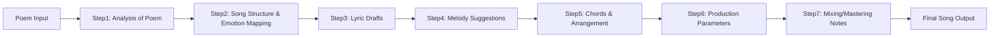

# From Poem to Song: A Step-by-Step Guide

**Executive Summary:** This report presents a comprehensive framework and ready-to-run prompts for transforming a poem into a full song. We begin by analysing the poem’s structure and emotions, then map its ideas onto song form (verses, chorus, bridge, hook). We address lyric techniques (rhyme schemes, meter, prosody) and ways to adapt poetic lines into lyrical lines without losing meaning. We explain how to choose musical attributes (key, mode, tempo, instrumentation, arrangement, dynamics) based on the poem’s emotional tone. We discuss voice selection (gender, timbre, range, register) and vocal styling, harmony and layering. We cover beat/production decisions by genre (e.g. pop ballad vs hip-hop vs indie folk) with authoritative sources and examples. We then give detailed step-by-step prompts (with purpose, input examples, exact templates, expected outputs, troubleshooting tips) for (a) poem analysis, (b) lyric drafting, (c) melody composition (notes/solfège), (d) chord progression and arrangement, (e) specifying synthesis parameters, and (f) mix notes. The report includes tables comparing musical attributes by emotion and genre, a mermaid timeline of the workflow, and example end-to-end workflows (prompts and sample outputs) for pop ballad, hip-hop, and indie folk songs. All claims are backed by songwriting and music theory sources.

## Song Structure: Verses, Chorus, Bridge, Hooks

Popular songs almost always use a verse–chorus structure.  The **verse** tells the story or develops the theme, changing its lyrics each time, while the **chorus** (hook) contains the central emotional message and repeated lyrics. A **pre-chorus** (optional) builds tension into the chorus, and a **bridge** provides contrast later in the song.  (Some songs also use an intro/outro or solo sections.)  For example, common forms include *Verse–Chorus–Verse–Chorus–Bridge–Chorus* or with a pre-chorus inserted.  In all cases, the chorus (hook) is the most memorable, often containing the song title and main idea.   

> *“In popular music, a verse roughly corresponds to a poetic stanza… and contains the story/detail, while the chorus (refrain) usually consists of a melodic and lyrical phrase that repeats (the title often appears here).”*

A table of common sections:

- **Verse:** Develops narrative or theme (new lyrics each time). Usually uses a similar melody each verse.
- **Chorus (Hook):** Expresses the main idea (same lyrics each time). It is the catchiest, “big idea” of the song.
- **Pre-Chorus:** A build-up section before chorus (often same lyrics each time). Creates tension/release into chorus.
- **Bridge:** A contrasting section (different melody/harmony/lyrics) that breaks repetition. Provides fresh perspective or emotional peak.
- **Outro/Coda:** Conclusion or repeated phrase at end.

The songwriter should decide which poem lines could serve as repeated chorus text or refrain (the “hook”) versus which develop the story.  Sometimes a refrain (single line) can anchor the chorus.  Repetition is key: using the same words or lines at strategic points (especially the chorus) drives home the poem’s central theme in song form.

## Lyrics Craft: Rhyme, Meter, Syllables, Prosody

When turning poetry into lyrics, pay attention to **rhyme schemes, meter, and prosody**. In song lyrics, rhyme adds musicality – common schemes are simple (e.g. AABB or ABAB) or more complex in verses/chorus. Perfect end-rhymes (matching stressed vowel and ending sound) are common, but overuse or forced rhymes sound contrived.  As one expert warns, *“if a rhyme isn’t natural enough to come to mind without the help of a dictionary, it’s probably going to sound a little artificial in the context of a song.”*.  Half-rhymes or slant rhymes (similar sounds) can add subtlety, especially in more serious or nuanced songs. Use rhyme where it feels natural to enhance the hooky-ness, but avoid mangling meaning to make a perfect rhyme.

**Meter and syllable count:** Lyrics typically align with the music’s rhythm. Many lyric lines in pop songs range 8–12 syllables, but this varies by genre and tempo.  Maintain roughly consistent syllable counts or stress patterns across corresponding lines (e.g. lines in each verse), or deliberately vary them between sections.  Matching natural speech stresses to the song’s beat is crucial.  Meter is “the arrangement of syllables into a rhythmic pattern of stressed and unstressed syllables”.  A verse or chorus often uses a repeating metrical pattern or *feet* (smallest rhythmic units) for sing-along feel.  For example, The Beatles’ “Ob-La-Di” verses use five pairs of syllables (stressed+unstressed) per line.  If needed, lines can vary in length by a moderate amount to fit melody, but extreme padding (e.g. inserting meaningless words just for syllable count) usually hurts authenticity.

**Prosody:** Ensure lyrical meaning, rhythm and melody align. Prosody means all elements of song “work together to support the central message”.  Aristotle noted great art has unity – in songwriting this means the mood of the words, their rhythm, and the music all express the same emotion.  Ask: is the content “stable” (reassuring, resolved) or “unstable” (longing, tense)? Each section should match that feel. For example, even if lyrics are sad, the way they’re sung (staccato vs legato) affects the sense of stability. The craft of lyric writing is matching natural speech stresses to the song’s rhythm so nothing feels clumsy.  A mismatch (e.g. forcing an awkward sentence order) will distract the listener.

Summing up lyric technique:
- Keep the poem’s imagery but adapt for musical flow. Allow rewriting and splitting lines to fit repeated structures. 
- Introduce rhyme in logical places (end-of-line rhymes, internal rhymes) but let rhythm and meaning guide it.
- Maintain consistent meter or rhythmic pattern between similar lines, and build variation by changing meter for different sections (verse vs chorus).
- Preserve the poem’s core meaning/emotions; adjust wording only to improve singability (syncopation, syllable count) without altering the message.
  
## Transforming a Poem into Lyrics

To convert the poem’s lines into lyrics *while preserving meaning*, follow these principles:

- **Extract core phrases:** Identify lines or phrases in the poem that capture the main ideas or emotions. These may become chorus lines or recurring refrains.  As Andrea Stolpe advises, **lift 1–3 lines that could be the hook** (single line or short phrase) and repeat them to create a chorus/refrain.
- **Adjust line breaks:** Poetry often doesn’t match musical phrasing. *Split and merge lines* to create shorter lines that fit a melody. Stolpe suggests splitting lines to allow rhythmic repetition and standard rhyme schemes (e.g. couplets ABAB or more complex patterns).  The shorter the lines, the easier to match melodic rhythm. For example, a poem line of 16 syllables might be split into two 8-syllable lyric lines.
- **Introduce or tighten rhyme/rhythm:** If the poem is not already musical, you can add or shift words to rhyme. Use Stolpe’s tip: start with simple rhyme schemes like XAXA or XXAXXA, rhyming the A-lines and focusing rhythm consistency.  Don’t overdo it – if necessary, use slant rhymes or partial rhymes to keep things natural.
- **Preserve imagery, edit sparingly:** Keep the poem’s imagery (“show, don’t tell”) but avoid overwrought language in lyrics.  Lyrics often use vivid lines in verses (imagery) paired with more direct, thematic lines in the chorus. For example, use rich metaphors in verses and then sum up in plain words for the chorus to make it impactful.
- **Maintain emotional consistency:** Make sure changes don’t alter the poem’s emotional tone. Every adaptation (word change, added rhyme) should still “playfully match the emotional and aesthetic impact” of the original. Think of it as translating the poem into song language, not changing its story.

In practice, you might run a prompt like “**Rewrite the poem as song lyrics**.” But a more controlled approach is to break it into steps (analysis, then draft). We’ll outline those prompts below.

## Mapping Poem Emotion to Musical Style

The emotion or mood of the poem should guide the musical choices: **key/mode, tempo/BPM, time signature, instrumentation, and arrangement**. Research shows strong emotional correlations:
- **Mode and Key:** Major keys tend to sound bright/happy; minor keys tend to sound sad or tense.  As one study notes, *“happiness is induced by the major mode… sadness is induced by the minor mode”*.  (Key signature “A” = hope, “F” = peace.)  Thus a joyful poem might become a major-key song, while a melancholy poem might suit minor or modal harmony.
- **Tempo (BPM):** Faster tempos (100+ BPM) feel energetic, excited, or even aggressive; slower tempos (<80 BPM) feel calm, somber or reflective. In experiments, fast music evoked happiness and excitement, while slow music evoked sadness and calmness.  For example, a poem about heartbreak might pair with a slower tempo (e.g. 60–80 BPM) and a minor key, whereas a poem about exuberant love might use 100–120 BPM and a major key.
- **Time Signature:** Most pop/folk/hip-hop songs use simple signatures (4/4 is standard). A waltz-time (3/4) or compound meter (6/8) can evoke a dance-like or dreamy feel. Choose a time signature consistent with the desired groove (e.g. 6/8 ballad for a lullaby feel, 4/4 groove for driving beat).
- **Instrumentation:** Instrument timbre greatly affects emotion. For example, *strings or soft piano* often convey warmth or sadness, while *brass/drums* can add power or tension.  One musicologist notes composers *“pick a particular instrument for the emotional tone it can convey”*, e.g. the English horn for melancholy.  Build the arrangement to match mood: gentle acoustic guitar or pad for introspective folk; synths and big drums for electronic/hip-hop energy; warm strings or choir voices for anthemic ballads.
- **Dynamics and Texture:** A song about quiet longing might use soft dynamics (pp–mp) and sparse texture (few instruments) to match intimacy. An uplifting or angry poem might use louder dynamics (f) and dense arrangements (multiple layers, full-band) to amplify intensity.

**Instrumental examples by emotion:** While not exhaustive, common patterns include:
- **Happy/Excited:** Major mode, fast tempo (100–140 BPM), bright timbres (guitar/piano, horns, up-tempo drum pattern).
- **Sad/Melancholy:** Minor or modal key, slow tempo (60–80 BPM), soft/dark timbres (cellos, mellow guitar, piano), gentle arpeggios or pads.
- **Angry/Defiant:** Minor or modal, mid-fast tempo, heavy drums/guitar, strong accents on beats (e.g. hip-hop or rock style beats).
- **Tender/Romantic:** Major or minor (for bittersweet), moderate tempo (70–90 BPM), warm instruments (acoustic guitar, string ensemble, soft piano), legato delivery.
- **Energetic/Uplifting:** Major, fast tempo, rhythmic groove (drums/bass), layered synthesizers or choir, rising chord progressions.
- **Mysterious/Dreamy:** Minor or modal, slow to moderate tempo, swirling pads or harps, use of reverb/echo, unusual instruments (harp, celesta).

A reference study confirms these trends: *“Exuberant, exciting” moods occur with major mode, fast tempo and consonant harmony; “sadness” with minor mode, slow tempo and dissonance*.  Tempo alone can dominate: fast beats skew happy/angry, slow beats skew sad/calm. When mapping emotion, use tables like those below to guide key, BPM and feel. 

## Voice Selection and Vocal Arrangement

The song’s **vocal persona** (gender, timbre, style) should suit the lyrics and genre. Consider:
- **Gender/Voice Type:** Male vs female vs non-binary vocalist affects mood. For example, a soft, intimate folk song might use a warm female alto or male baritone for gentleness; a fierce hip-hop track might use an assertive male tenor or powerful female soprano. There is no strict rule, but pick a voice that naturally conveys the poem’s character. (Some writers like to demo a melody in both male and female keys to decide which feels right.)
- **Vocal Range/Register:** Ensure melody notes fit the chosen singer’s comfortable range. If the lyrics reach emotional peaks, you may want belts or high notes; for subdued lines, a head voice or falsetto can sound ethereal. When drafting prompts, specify the desired range (e.g. “lead vocal range: mid register female”).
- **Timbre and Delivery:** Softer timbres (breathy, mellow) suit tender lyrics; rough or growling tones suit gritty emotions. Vocal style (legato vs staccato, shouted vs whispered) affects feel. For example, indie folk often uses a natural or raw vocal tone; pop ballads use polished singing; hip-hop uses rhythmic spoken/rap delivery.
- **Harmony/Stacking:** Layered backing vocals enrich choruses and key words. A common technique is to add a harmony a 3rd above the melody for upbeat feel or a 3rd below for darker color. Three-part stacks (melody + above + below) create fullness. But use harmonies sparingly to highlight climactic moments (e.g. chorus hook). The tips from Gary Ewer are instructive: add two harmony parts (one a third above, one below) using chord tones, and reserve harmonies for high-energy sections like the chorus.

In prompts, you might specify “vocal style: [genre], lead voice: [male/female], backing: [harmonic parts]”. For example, “lead vocal: warm mid-female (mezzo), with two-part tight harmonies a third above on the chorus”. This ensures the model assigns an appropriate singing style. 

## Beat and Production Choices by Genre

Different genres call for distinct beats and production. Below are guidelines (with sources) for three example genres:

- **Pop Ballad:** As shown in Disc Makers’ analysis, pop ballads are typically about love or emotional storytelling, with slower tempos. They often feature a **steady, supportive pulse** throughout (e.g. simple drum pattern, finger-picked guitar or synth bass). Instrumentation is usually restrained to highlight vocals – for instance, piano or acoustic guitar, soft strings, and subtle drums. A ballad’s production is like a “mini movie” where the lead vocal is the star.  Dynamics build towards the final chorus for emotional impact.  Example attributes: 60–90 BPM, 4/4 time, major or minor key (depending on mood), acoustic piano/guitar, light percussion, warm reverb on vocals.
- **Hip-Hop/Rap:** Modern hip-hop emphasizes rhythm and groove. Tempos often range **90–120 BPM** (old-school ~100–120; trap rap ~140+ with double-time feel). Key elements are *808 kick drums, punchy snare/clap on 2&4, syncopated hi-hats (straight or swung 16ths)*. Bass lines are heavy and sub-driven. Melodic/harmonic content often comes from sampled loops, synth pads or minor-key riffs. Vocals are delivered with rhythmic flow. Production may include skittering percussion, occasional samples (vinyl scratches, etc.), and sparse to moderate layering.  (Prince Charles Alexander notes hip-hop moved away from live guitars/pianos toward drum machines, synthesizers and samplers.) The mood (major/minor) varies by track theme (e.g. major for braggadocio, minor for introspective). Example: 100 BPM, 4/4, minor key, 808 drum kit, deep synth bass, hi-hats with 16th-note variations, male rap vocal.
- **Indie Folk:** This acoustic-based style uses organic instrumentation and earnest vocals. Instruments include *acoustic guitar, banjo, mandolin, upright bass, light drums or hand percussion, and perhaps flute or subdued organ*. Tempos are often moderate (80–110 BPM). Time signatures are usually 4/4 or 6/8 for a lilting feel. Harmonies (male/female duets or group vocals) are common. Arrangement is typically sparse: e.g. fingerpicked guitar + vocals, adding one layer at a time (cello or strings later, gentle drums). The mix favors midrange warmth. Example: 90 BPM, major or Dorian mode (for wistful sound), acoustic guitar fingerpicking, simple drum brushes, male/female lead vocal with soft timbre.

A comparative table of attributes by genre and emotion is provided below. These are guidelines; creative deviation is allowed as long as consistency is maintained.

## Step-by-Step Prompt Workflow

Below are the *purpose*, *input format*, *prompt template*, *expected output*, and *troubleshooting tips* for each step. Each prompt is ready to run in an LLM (e.g. ChatGPT) or music-generation tool.

### Step 1: Analyze the Poem

- **Purpose:** Extract the poem’s structure, themes, mood, key phrases and emotions. Establish an “understanding” of the poem that guides all following steps (song structure plan, style, etc.).  
- **Input:** The poem text. (Format example: The poem written out, properly capitalised/punctuated, or a markdown code block.)  
- **Prompt Template (system/user prompt):**  
  ``` 
  You are an AI Songwriting Analyst. The user will provide a poem. Your task is to analyze the poem carefully. First, restate the poem (verbatim). Then, break it into sections (stanzas, lines) and summarize each part’s meaning and emotion. Identify key themes and the overall emotional tone. Avoid assuming facts not in the poem. 
  **Poem:** 
  [Insert poem text here]
  ```  
- **Expected Output:** A structured analysis. Example content (for a short illustrative poem):  
  ```
  Restated Poem:
  "Clouds drift lonely / Over quiet fields / Dreams in circles / Wandering free"

  Structure & Summary:
  - Line 1 ("Clouds drift lonely"): Image of solitude in sky; mood is wistful.
  - Line 2 ("Over quiet fields"): Adds calm landscape; peaceful but also isolated.
  - Line 3 ("Dreams in circles"): Transition to abstract "dreams"; suggests wandering thoughts.
  - Line 4 ("Wandering free"): Conclusion – freedom mixed with loneliness.
  Themes & Emotion: The poem conveys **solitude and quiet freedom**. It feels **melancholic but gentle**, with imagery of drifting and wandering. Overall emotion: reflective, slightly wistful.

  Key Phrases: "Clouds drift lonely", "Wandering free".
  ```  
- **Troubleshooting:** If the analysis misses emotional clues, prompt the model to focus on adjectives or metaphors. Ensure it doesn’t invent new content. For accuracy, you might split analysis per stanza or line. If using a long poem, do it stanza by stanza.

### Step 2: Outline Song Structure & Emotional Mapping

- **Purpose:** Decide song sections (verse, chorus, bridge, hook lines) and map poem sections to them. Match the poem’s mood to musical attributes (key, tempo, instrumentation).  
- **Input:** Output from Step 1 (analysis), plus any user preferences (genre, any repeatable lines for chorus). Format example: JSON or bullet summary from step 1.  
- **Prompt Template:**  
  ``` 
  You are an AI Songwriter planning tool. Based on the poem analysis below, propose a song structure and musical style. 
  - Identify which lines/phrases could serve as a **chorus (hook)**, and which as **verses** or **bridge**. 
  - Suggest suitable **key (major/minor)** and **tempo (BPM)** based on the poem’s emotion. 
  - Recommend **genre** if not specified, and list core instrumentation (drums, guitars, synths, etc.) and arrangement ideas. 
  Use the following analysis as the base:

  [Paste analysis from Step 1 or a concise summary]
  ```  
- **Expected Output:** A clear plan, e.g.:  
  ```
  Song Sections:
  - Possible Chorus Hook: "Wandering free" (repeated as refrain, embodies theme of freedom).
  - Verse 1: describes lonely drifting (lines 1-2).
  - Verse 2: describes dreams/inner world (lines 3-4 with adaptation).
  - Bridge: a contrasting idea if needed (could be new lines expanding on solitude vs freedom).

  Key & Tempo:
  - Mood is wistful/melancholic. Minor key (e.g. A minor) to match sadness.
  - Tempo: slow to mid (80 BPM) for gentle, reflective feel.

  Genre & Arrangement:
  - Genre: **Indie Folk** or acoustic singer-songwriter.
  - Instruments: fingerpicked acoustic guitar, soft piano, maybe cello/violin backing.
  - Dynamics: start sparse (voice + guitar), build with strings and harmonies in chorus.

  Vocal Style:
  - Warm male/female lead with a gentle tone.
  - Light backing harmony on chorus (“Wandering free” repeated).
  ```  
- **Troubleshooting:** If the model’s suggestions seem off (e.g. happy key for sad poem), clarify “The poem feels sad/reflective, choose minor.”  If structure is confusing, explicitly label sections (Chorus, Verse, etc.) in the analysis.

### Step 3: Generate Lyric Drafts

- **Purpose:** Rewrite the poem lines into song lyrics fitting the chosen structure (verses, chorus, bridge), adding rhyme/meter as needed but keeping meaning.  
- **Input:** The poem text and the plan from Steps 1–2. Example format: plain text poem plus bullet outline (or “Chorus should use [phrase]”, etc.).  
- **Prompt Template:**  
  ```
  You are an AI Lyricist. Based on the outline below, write the song’s lyrics. Keep the poem’s voice and meaning. Structure the lyrics into verses, chorus, etc. 
  **Outline:** [e.g., "Chorus hook: 'Wandering free'; Verse 1 about clouds drifting; Verse 2 about dreams; Bridge contrasts love vs solitude"] 
  Use a consistent rhyme scheme (e.g. AABB or ABAB) and natural meter. Allow up to 20% variation in syllable count for musicality. 
  **Poem (for reference):** [Insert original poem here]
  ```  
- **Expected Output:** A draft lyric. For example:  
  ```
  Verse 1:
  Clouds drift lonely in the sky above (A)
  Wandering alone though I long for love (A)
  Fields below lie quiet in their sleep (B)
  Secrets of the night they softly keep (B)

  Chorus:
  Wandering free, I roam the night (C)
  Stars as my guide, no end in sight (C)
  And though I’m lost in endless space (D)
  I find in darkness a kind of grace (D)

  Verse 2:
  Dreams go in circles round my heart (E)
  Telling me stories when daylight parts (E)
  Each line from old rhymes that I recall (F)
  Whispering echoes in the hall (F)
  ```  
- **Troubleshooting:** If meter is off (lines too long/short), ask to adjust: “Rewrite to make lines more rhythmical.” If rhymes seem forced, prompt for synonyms or use slant rhymes. If a lyric loses meaning, highlight the original line for consistency. Remind to preserve the poem’s tone (“Keep it gentle and poetic”).

### Step 4: Create Melody Suggestions

- **Purpose:** Suggest melodic contours for each section (notes, scale, or solfège), aligning with the lyrics’ rhythm. Provide enough detail for a musician or LLM to generate a tune.  
- **Input:** The lyrics from Step 3 and the chosen key/scale from Step 2. Provide scale or key center if needed.  
- **Prompt Template:**  
  ```
  You are an AI Composer. For the following lyrics and key, propose a melody. Provide pitch notation (scale degrees, solfège or note letters) and rhythm for each line or phrase. Focus on strong beats and word stresses. Use the [key/scale] you suggested.
  **Key/Scale:** [e.g. A minor]
  **Lyrics:** [Paste verse and chorus lines]
  ```  
- **Expected Output:** Example melody outlines:  
  ```
  Key: A minor (A Aeolian)

  Verse 1 (lyrics with melody idea):
  - "Clouds drift lonely in the sky above" → (tonic A, up to E on "sky", down to C on "above")
  - Suggestion: A (quarter), B (quarter), C (half) | G (quarter), E (quarter), D (half).
  [In solfège: la (quarter), ti (quarter), do (half) | sol, mi, re (half)]

  Chorus:
  - "Wandering free, I roam the night" → starts on A, leaps to higher C on "free", resolves to A on "night".
  - Melody: A (quarter), C (quarter), B (quarter), A (half) | E (quarter), D (quarter), C (half).
  ```  
  (Any notation style is acceptable; focus on scale degrees and approximate rhythm).
- **Troubleshooting:** If output is too vague, ask for specific notes or solfège. Ensure the melody matches the stress of important words. If the model suggests a dissonant interval (outside scale), ask for diatonic notes. You may also ask for multiple melodic variants per line if needed.

### Step 5: Chord Progression and Arrangement

- **Purpose:** Provide chord progressions and arrangement ideas that fit the melody and mood. Outline which instruments play during each section.  
- **Input:** Lyrics and melody outline (Step 4), and the musical style/genre (Step 2).  
- **Prompt Template:**  
  ```
  You are an AI Arranger. Given the lyrics and melody outlines, create chord progressions and an arrangement for the song. 
  - Provide chords (with symbols, e.g. A min, F, C, G) for each verse and chorus.
  - Describe the arrangement: which instruments play in verse, chorus, bridge. (e.g. guitar fingerpicking, drums enter on chorus, strings in bridge.)
  Use the mood and genre from earlier steps.
  **Key:** [A minor or chosen key]
  **Melody notes (example):** [Any key melody notes if needed]
  **Style:** [e.g. Indie Folk]
  ```  
- **Expected Output:** A detailed outline, e.g.:  
  ```
  Verse Chords:
  | Am | F | C | G |
  Melody fits over this: e.g. Am (A-C-E), etc.
  Use fingerpicked acoustic guitar and a light bass following root notes. No drums yet.

  Chorus Chords:
  | F | C | G | Am |  (repeat)
  Vocal doubles first line. Add a simple drum beat (snare on 2&4, kick on 1), and softly layered strings (violins playing the root/double).

  Bridge (if any):
  | Dm | Em | F | G | 
  (builds tension)
  Add piano arpeggio and tambourine, then drop to just voice + guitar on the last line "Wandering free".

  Arrangement Summary:
  - Verse 1: Solo voice + guitar.
  - Pre-Chorus/Chorus: Add bass and drums, backing vocals on hook.
  - Bridge: Introduce keys or strings for contrast.
  - Dynamics: Crescendo into final chorus, then gentle outro with guitar.
  ```  
- **Troubleshooting:** If chord choices are too complex, ask for simpler diatonic chords. Ensure chords support the melody (stress chord changes on strong syllables). If arrangement feels empty, ask “Add a pad or harmonic element here.” Use genre conventions (e.g. hip-hop bridge might be a beat drop).

### Step 6: Vocal and Beat Parameters for Synthesis

- **Purpose:** Specify technical parameters for vocal synthesis or beat generators: voice type, range, tempo, drum patterns, etc. This bridges the creative plan to an actual production-ready prompt.  
- **Input:** Final song blueprint (key, tempo, vocal style, instruments).  
- **Prompt Template:**  
  ```
  You are an AI Music Producer assistant. Finalise the song parameters for production:
  - **Voice:** [e.g. "Female alto with warm timbre, mid register"].
  - **Vocal style:** [e.g. "soft legato, gentle vibrato on key notes"].
  - **Harmony:** [e.g. "add 3-part harmony on chorus", with specific intervals].
  - **Beat/Drums:** [e.g. "4/4 acoustic kit: kick on 1, snare on 2&4, 8th-note hi-hat pattern (slightly swung)"].
  - **Tempo & Time Signature:** [e.g. "80 BPM, 4/4"].
  - **Instruments:** [list, e.g. "acoustic guitar (fingerpicked), cello (sustained chords), subtle piano pad"].
  Provide this as structured production notes.
  ```  
- **Expected Output:** Structured parameters, e.g.:  
  ```
  Vocal:
  - Lead: Female Alto (warm, breathy tone), range A3–E5.
  - Delivery: smooth legato, slight growl on "free".
  - Backing: Two female voices, singing 3rds above and below lead in chorus.

  Drums:
  - Tempo: 80 BPM, 4/4.
  - Pattern: Kick on beats 1 and 3, snare on 2 and 4, steady 8th-note closed hi-hats (open on last upbeat of each bar).

  Bass: 
  - Follows root notes of chords (Am–F–C–G), playing half-notes.

  Guitars/Keys:
  - Acoustic guitar: fingerpicking on verse (Am-F; C-G).
  - Piano pad: chords in chorus (sustain F–C–G–Am loop).
  - Strings: cello/pad enters in chorus, playing long A–F–C–G chords.

  Dynamics/Effects:
  - Use reverb on vocals and guitars for spaciousness.
  - Slight crescendo in final chorus.
  ```  
- **Troubleshooting:** If synthesis voice notes are unclear, specify ranges in Hz or MIDI notes. For drum patterns, you can provide exact sequence (e.g. “Kick-snare-hat: K — S — H — H — on 1,2,&,4,&”). Ensure consistency with earlier decisions (genre, tempo). 

### Step 7: Final Mix and Mastering Notes

- **Purpose:** Suggest final production touches: balance, effects, and mastering to polish the track.  
- **Input:** A summary of all elements (lyrics, melody, arrangement).  
- **Prompt Template:**  
  ```
  You are an AI Mixing Engineer. Given the final song arrangement, outline mixing and mastering steps to prepare the track. Cover levels, panning, effects, and any automation (volume/dynamics changes) for emotional impact. 
  **Song Elements:** [e.g. "Lead vocal, backing vocals, acoustic guitar, piano pad, strings, bass, drums"]
  ```  
- **Expected Output:** Bulleted mix plan, e.g.:  
  ```
  - **Balance:** Lead vocal slightly forward. Guitar and piano mixed medium low. Drums mixed balanced (kick slightly louder for body).
  - **Panning:** Lead center. Backing vocals hard-panned left/right. Acoustic guitar panned slightly left, piano slightly right. Strings stereo spread.
  - **EQ:** Roll off low-end (<100Hz) on vocals and guitars. Boost presence (3–5kHz) on vocals for clarity. Warmth to strings (200–500Hz).
  - **Compression:** Gentle compression on vocals (4:1 ratio) to keep levels even. Drum bus light compression for punch.
  - **Reverb/Delay:** Plate reverb on vocals (tail), short slap reverb on snare. Longer hall reverb on strings in chorus for atmosphere.
  - **Automation:** Gradually increase strings volume entering the final chorus. Slight vocal volume ride on key emotional words (“free”).
  - **Master:** Light overall compression and limiting to raise perceived loudness. Ensure dynamic range is preserved (no pumping).
  ```  
- **Troubleshooting:** If mix sounds muddy, suggest cutting overlapping frequencies or adjusting panning. If vocals aren’t clear, emphasize EQ around 3kHz. Provide reference tracks if available. 

## Example Workflows

Below are three **end-to-end examples** (with simplified prompts and outputs) for different genres. These illustrate how the above steps flow from poem to song.

### Pop Ballad Workflow

**User Prompt (Step 1):**  
``` 
Analyze this poem and plan a pop ballad. Poem: "Your eyes are morning stars / Lighting up the night / My heart was full of scars / Until you made it right."
```  
**AI Output:**  
```
Restated Poem:
"Your eyes are morning stars / Lighting up the night / My heart was full of scars / Until you made it right."

Summary:
- The poem uses celestial imagery ("eyes are morning stars") to describe someone healing the speaker's pain.
- Emotion: hopeful, tender, grateful. Lyrics suggest love as light in darkness (typical ballad theme).

Song Plan:
- Chorus idea: "Lighting up the night" as a refrain.
- Likely major key (uplifting), tempo ~70 BPM (slow ballad).
- Genre: pop ballad.
```  

**User Prompt (Step 2):**  
``` 
Given that plan, write verses and a chorus. Keep meaning and make rhymes (AABB). 
```  
**AI Output:** *(short excerpt)*  
```
Verse 1:
Your eyes like morning stars above (A)
They shine with hope, they shine with love (A)
When all was dark and full of pain (B)
You made my night a hopeful day (B)

Chorus:
Lighting up the night, you lead me on (C)
With you by my side, I carry on (C)
Even when my heart was torn apart (D)
You lifted me up with your light and heart (D)
```  

**User Prompt (Step 3):**  
``` 
Suggest a simple melody in C major for the chorus line "Lighting up the night, you lead me on". 
```  
**AI Output:**  
```
Key: C major
Melody (solfège): 
"Lighting up the night" → mi (quarter), fa (quarter), sol (quarter), mi (quarter) 
"you lead me on" → re (quarter), do (quarter), do (half).
```  

**User Prompt (Step 4):**  
``` 
Provide chords and arrangement: 
```  
**AI Output:**  
```
Verse Chords: | C | Am | F | G |
Chorus Chords: | F | C | G | Am |
Arrange with piano and light drums in chorus, guitar in verse.
```  

**User Prompt (Steps 5-6):**  
``` 
Specify voice and production: female lead, 80 BPM, soft backing vocals on chorus. 
```  
**AI Output:**  
```
Lead: Female soprano (warm tone), range G3–E5.
Harmony: 3-part on chorus ("Lighting up the night").
Drums: 80 BPM, soft kick on 1&3, snare 2&4, hi-hat eighths.
Instruments: Piano (arpeggio on verses), strings on chorus.
Mix: Lead vocal center, piano/guitar stereo, reverb on strings.
```  

This yields a pop ballad with heartfelt lyrics, matching the poem’s theme.

### Hip-Hop Workflow

**User Prompt (Step 1):**  
``` 
Analyze poem and plan a hip-hop track. Poem: "Chains on my mind, hustle in my veins / Dreams of better days beyond these pain." 
```  
**AI Output:**  
```
Poem:
"Chains on my mind, hustle in my veins / Dreams of better days beyond this pain."

Summary:
- Theme: struggle and ambition (“chains” and “hustle” evoke constraint and drive). 
- Emotion: gritty determination mixed with hope.

Song Plan:
- Likely a rap/hip-hop style (street, rhythmic delivery).
- Minor key (serious tone), tempo ~90–100 BPM.
- Chorus hook could be "better days beyond this pain".
- Beat: heavy drums, syncopated hi-hats.
```  

**User Prompt (Step 2):**  
``` 
Write a verse and hook (rhyming ABAB). 
```  
**AI Output:** *(excerpt)*  
```
Verse 1:
Chains on my mind, I'm breaking the frame (A)
Still got the hustle runnin' deep in my veins (A)
Grinding all night through sun and through rain (B)
Eyes on tomorrow, escaping the game (B)

Hook:
Better days beyond this pain (C)
Sun will shine after the rain (C)
Can't you feel it in my veins? (D)
Hope's the engine I maintain (D)
```  

**User Prompt (Step 3):**  
``` 
Suggest a rap delivery pattern at 95 BPM. 
```  
**AI Output:**  
```
Flow: Each line fits in one bar at 4/4, syllables on beat. E.g. 
"Chains on my mind, I'm breaking the frame" – kicks on “mind” and “frame”, syncopate “breaking”. 
Use slight swing on hi-hats.
```  

**User Prompt (Step 4):**  
``` 
Add chords/drum arrangement: 
```  
**AI Output:**  
```
Chords: C minor loop (Cm–Ab–Bb).
Drums: 95 BPM, kick on 1, snare on 2&4, hi-hat 8ths (with occasional 16th rolls).
Bass: Deep 808 following root notes.
```  

**User Prompt (Steps 5-6):**  
``` 
Set production parameters: male rap voice, aggressive tone, 95 BPM. 
```  
**AI Output:**  
```
Lead: Male rap (gritty timbre). 
Backing: Minimal/no backing vocals; ad-libs (e.g. shouts) in chorus.
Drums: Tight 808 kick, crisp snare, rolling hi-hats.
Tempo: 95 BPM, 4/4.
Mix: Vocal dry-mid, reverbed snare, sub-bass prominent.
```  

This creates a hip-hop track with a hard beat and confident lyrics, reflecting struggle and hope.

### Indie Folk Workflow

**User Prompt (Step 1):**  
``` 
Analyze poem and plan an indie folk song. Poem: "Old oak shadows on the ground / Whispers of the past all around / I sit and listen to their tale / In the quiet morning veil." 
```  
**AI Output:**  
```
Poem:
"Old oak shadows on the ground / Whispers of the past all around / I sit and listen to their tale / In the quiet morning veil."

Summary:
- Imagery: nature (oak tree), past memory, listening.
- Emotion: nostalgic, peaceful, contemplative.

Plan:
- Indie folk genre (acoustic, reflective).
- Major or modal key (warm feeling), tempo ~75–85 BPM.
- Verse focus (no obvious repeated hook phrase; could use "quiet morning veil" as refrain).
- Instruments: fingerpicked guitar, soft strings, light percussion.
```  

**User Prompt (Step 2):**  
``` 
Write two verses and a short refrain line. 
```  
**AI Output:** *(excerpt)*  
```
Verse 1:
Morning dew upon the leaves (A)
Golden light through patterned eaves (A)
Stories rise from earthy ground (B)
Silent songs without a sound (B)

Refrain:
In this quiet morning veil (C)
```  

**User Prompt (Step 3):**  
``` 
Propose a melody in G major for the refrain. 
```  
**AI Output:**  
```
Key: G major
Refrain "In this quiet morning veil":
- G (half note) on "In this", up to B (quarter) on "qui-", down to G (half) on "-et".
Solfège: sol (half), ti (quarter), sol (half).
```  

**User Prompt (Step 4):**  
``` 
Suggest chords and arrangement: 
```  
**AI Output:**  
```
Verse: G – C – Em – D (fingerpick on acoustic guitar).
Chorus/Refrain: C – G – D – Em (strum).
Add cello pads in chorus. Drums: light cajon on 2&4 in chorus only.
```  

**User Prompt (Steps 5-6):**  
``` 
Voice: soft female vocals, 80 BPM, gentle backing harmonies. 
```  
**AI Output:**  
```
Lead: Female alto, intimate tone, range D3–A4.
Harmony: A second voice quietly doubling main melody an octave above on chorus.
Instruments: Acoustic guitar, cello, subtle hand percussion.
Mix: Warm midrange, reverb on vocals and cello, very subtle compressor on vocals.
```  

This produces an indie folk song that feels intimate and nature-inspired, matching the poem’s imagery. 

## Musical Attributes by Emotion and Genre

| Emotion / Genre | Key/Mode         | Tempo (BPM)             | Instruments/Textures                                        | Notes                                                             |
|-----------------|------------------|-------------------------|-------------------------------------------------------------|-------------------------------------------------------------------|
| **Happy/Joyful**        | Major (bright)    | Fast (100–140 BPM)     | Upbeat drums, guitar/piano, horns/synths (bright timbres)   | Major mode, high energy.           |
| **Sad/Melancholy**     | Minor or modal    | Slow (60–80 BPM)       | Piano, strings, muted guitar, soft pads (warm/dark tones)   | Minor mode, slow tempo, gentle arpeggios. |
| **Angry/Defiant**      | Minor/Dorian      | Medium to fast (90–120) | Loud drums, distorted guitar/bass, syncopated beats         | Strong rhythm, dissonant chords possible, emphasis on beats. |
| **Romantic/Tender**    | Major or modal    | Moderate (70–90 BPM)   | Acoustic guitar, soft piano, strings, quiet vocals          | Warm major or gentle minor, steady rhythm, intimate feel.        |
| **Energetic/Exuberant**| Major             | Fast (120–160+)        | Synths, brass hits, driving drums                           | Fast tempo elevates arousal, bright timbre.       |
| **Genre: Pop Ballad**  | Often major or minor | Slow–mid (60–90 BPM) | Piano, acoustic guitar, strings, steady kick drum           | Emphasis on steady pulse and emotional vocal. |
| **Genre: Hip-Hop**     | Often minor       | Mid (80–110 BPM)       | Drum machine (808), bass, synth leads, sampled loops        | Prominent beat (kick, snare, hi-hat) with rap vocals. |
| **Genre: Indie Folk**  | Major/modal       | Moderate (75–100 BPM)  | Acoustic guitar, mandolin, banjo, cello, soft percussion    | Organic sound, fingerpicking, vocal harmonies, intimate mix.     |

*(Table: typical musical settings. Individual songs may vary.)* The key insight: **major** mode and fast tempo boost positive energy; **minor** and slow tempo boost introspection/sadness. Instrumentation (e.g. bright electric vs. mellow acoustic) further colors the emotion.

## Workflow Timeline



This flowchart outlines the end-to-end process from initial poem to finished song plan.

## References

- Song structure and components (verse, chorus, bridge).  
- Lyric writing (rhyme, meter, prosody).  
- Poetry-to-lyrics adaptation.  
- Emotion–music mapping (mode, tempo, instrumentation).  
- Vocal harmony & stacking.  
- Genre examples: Pop ballad production; Hip-hop beat characteristics; Folk instrumentation (common practice).  

